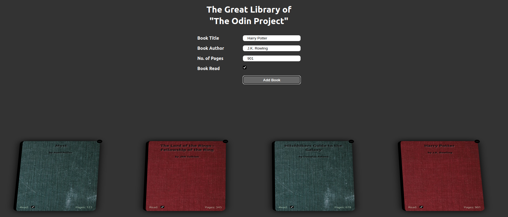

# The Odin Project - Library

## What is is?

A library, written in HTML, CSS and JS. Based on the "The Odin Project" curriculum found [here](https://www.theodinproject.com/paths/full-stack-javascript/courses/javascript/lessons/library).

## Features

- [x] Add books to the library
- [x] Delete books from the library
- [x] Mark books as read / unread
- [x] Display all books in the DOM
- [x] Responsive Layout

## Image

